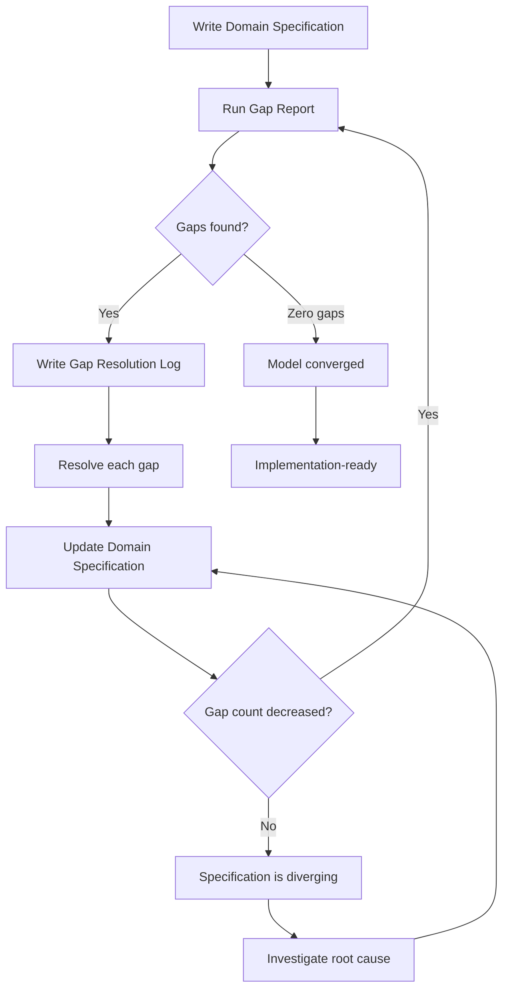
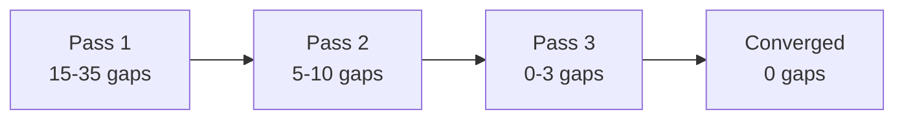

# Convergence Flow

This diagram shows the iterative three-pass convergence process at the heart of Signal-Driven Development.

## Process Overview

## Key Decision Points

**"Gaps found?"** -- After running the gap report, if zero gaps remain, the model is converged. Every question the model raised has been answered.

**"Gap count decreased?"** -- This is the convergence invariant. Each pass must reduce the gap count. If it does not, the specification is diverging. Non-convergence is the most important signal the process can produce. It means a resolution introduced more complexity than it removed, and the root cause must be investigated.

## Typical Trajectory

## Artifacts Per Pass

Each pass produces three artifacts:

| Artifact | Purpose |
|----------|---------|
| Domain Specification | The domain model expressed in DDD building blocks |
| Gap Report | Diagnostic evaluation against four gap categories |
| Gap Resolution Log | Decisions made against each gap with rationale |

The domain specification is the living document. It evolves across passes. The gap report and resolution log are snapshots -- they record what was found and what was decided at that point in time.
