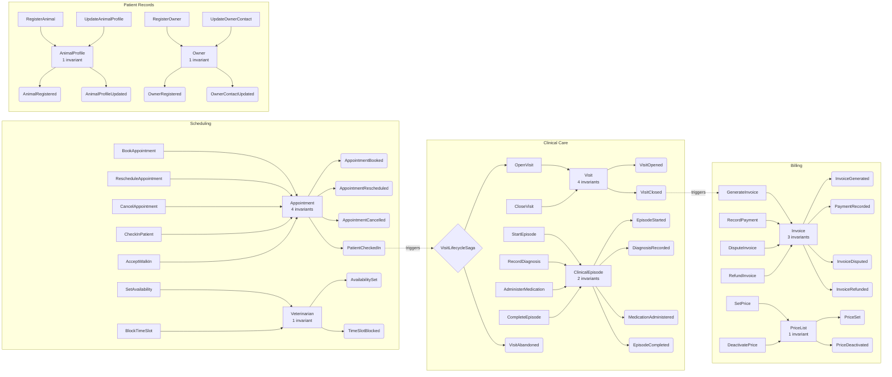

# Architecture Palette — Greenfield Veterinary Clinic (Pass 3 — Final)

> **Source**: Domain Specification — Greenfield Veterinary Clinic (Pass 3)
> **Date**: 2026-03-20
> **Layout**: Horizontal swimlane per bounded context

---

## How to Read This Palette

The architecture palette is a visual projection of the domain specification. Each bounded context is a swimlane. Inside each swimlane, building blocks are arranged to show the flow: **Command -> Aggregate -> Domain Event -> Policy/Saga -> Command** (the reactive chain).

---

## Palette

### Cross-Context Reactive Chains

1. **Scheduled visit path**: `BookAppointment` -> Appointment -> `AppointmentBooked` ... `CheckInPatient` -> `PatientCheckedIn` -> VisitLifecycleSaga -> `OpenVisit` -> Visit -> episodes -> `CloseVisit` -> `VisitClosed` -> `GenerateInvoice` -> Invoice
2. **Walk-in path**: `AcceptWalkIn` -> Appointment -> `AppointmentBooked` + `PatientCheckedIn` -> VisitLifecycleSaga -> (same as above)
3. **Abandonment path**: VisitLifecycleSaga timeout -> `VisitAbandoned` (no invoice)

### Conventions

- **Aggregates**: Rectangles with invariant count.
- **Commands**: Rectangles flowing into aggregates.
- **Domain Events**: Rounded nodes flowing out of aggregates.
- **Policies/Sagas**: Dashed lines showing reactive triggers.
- **Cross-context flows**: Dashed lines with relationship label.

---

## Building Block Summary by Context

| Context | Aggregates | Commands | Events | Policies | Sagas | Projections | Invariants |
|---------|-----------|----------|--------|----------|-------|-------------|------------|
| Scheduling | 2 | 7 | 6 | 0 | 0 | 1 | 5 |
| Patient Records | 2 | 4 | 4 | 0 | 0 | 0 | 2 |
| Clinical Care | 2 | 6 | 7 | 1 | 1 | 1 | 7 |
| Billing | 2 | 4 | 6 | 1 | 0 | 1 | 4 |
| **Total** | **8** | **21** | **23** | **2** | **1** | **3** | **18** |

---

## Observations

1. **Invariant distribution is balanced.** Every context has at least 2 invariants. No aggregate has zero. This was not the case in Pass 1 where Appointment and Visit both had none.

2. **The reactive chain is clear.** The Scheduling-to-Clinical-Care handoff via `PatientCheckedIn` and the Clinical-Care-to-Billing handoff via `VisitClosed` are the two primary cross-context flows. Both are event-driven with explicit contracts.

3. **The saga is the architectural centerpiece.** VisitLifecycleSaga orchestrates the longest process in the domain (check-in through invoice generation). It handles both the happy path and the abandonment path with explicit compensation.

4. **Patient Records is a stable upstream.** It has no sagas, no policies, and no downstream triggers. It supplies identity and history. This is appropriate for a context that owns persistent reference data.

5. **Billing is purely reactive.** Every command in Billing is triggered by an upstream event or an administrative action (pricing). Billing initiates nothing. This is a clean downstream consumer pattern.

6. **Event count (23) exceeds the building block inventory (19).** The saga emits 2 additional events (`VisitAbandoned`, `VisitTimeoutWarning`) and the invoice lifecycle adds 2 more (`InvoiceDisputed`, `InvoiceRefunded`) beyond the Pass 1 count. The inventory delta is correct when counting unique event types introduced per pass.
