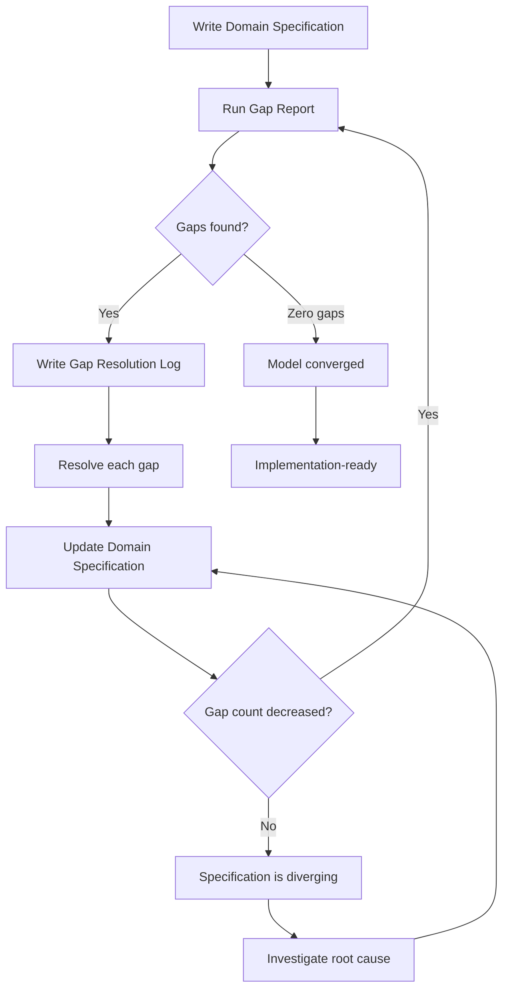
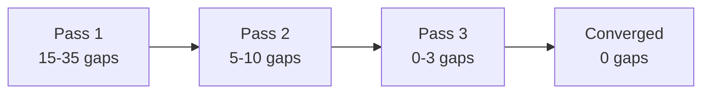

# Convergence Model

The convergence model is the iterative three-pass process at the heart of Signal-Driven Development. Each pass produces three artifacts, and the gap count must decrease across passes until zero unresolved gaps remain.

## Process Flow

## Key Decision Points

### "Gaps found?"

After running the gap report, if zero gaps remain, the model is converged. Every question the model raised has been answered.

### "Gap count decreased?"

This is the **convergence invariant**. Each pass must reduce the gap count. If it does not, the specification is diverging. Non-convergence is the most important signal the process can produce. It means a resolution introduced more complexity than it removed, and the root cause must be investigated.

## Typical Trajectory

| Pass | Typical Gap Count | What Happens |
|------|-------------------|--------------|
| 1 | 15--35 | Initial extraction. Structural errors, missing invariants, heuristic violations surface. |
| 2 | 5--10 | Focused resolution. Real architectural decisions get made and documented. |
| 3 | 0--3 | Final convergence. Residual tradeoffs resolved or consciously accepted. |

Some domains require 4--5 passes. Simple domains may converge in two. The number of passes is not the metric -- convergence is.

## Artifacts Per Pass

Each pass produces three artifacts:

| Artifact | Purpose | Mutability |
|----------|---------|------------|
| **Domain Specification** | The domain model expressed in DDD building blocks | Living document -- evolves across passes |
| **Gap Report** | Diagnostic evaluation against four gap categories | Immutable snapshot |
| **Gap Resolution Log** | Decisions made against each gap with rationale | Immutable snapshot |

The domain specification is the only artifact that changes between passes. Gap reports and resolution logs are immutable records of what was found and what was decided at that point in time.

## Pass Characteristics

### Pass 1 -- Extraction

The first pass is about getting everything named and placed. Do not aim for perfection. Write the domain specification for your bounded contexts, aggregates, commands, events, and invariants. The gap report will find what you missed.

**Typical findings:**

- Aggregates with zero invariants (data containers, not consistency boundaries)
- Commands without corresponding events
- Missing cross-context relationships
- Undefined terms in the ubiquitous language

### Pass 2 -- Resolution

The second pass is where real architectural decisions get made. The gap report from Pass 1 has surfaced structural debt, heuristic violations, and language ambiguities. Now you resolve them.

**Typical decisions:**

- Boundary redraws between contexts
- Aggregate decomposition (splitting overloaded aggregates)
- Saga introduction for multi-step processes
- Glossary formalization

### Pass 3 -- Convergence

The third pass confirms that all gaps have been resolved. If zero gaps remain, the model is implementation-ready. If 1--3 gaps remain, they are typically decision gaps representing conscious tradeoffs.

**Typical outcomes:**

- Zero gaps -- model converged
- 1--3 residual warnings documented as intentional
- Architecture palette created as visual verification

## The Convergence Invariant

The convergence invariant is the single most important rule in SDD:

> **Gap count must decrease across passes. If Pass N+1 identifies more gaps than Pass N resolved, the specification is diverging.**

Common causes of divergence:

- A boundary change that created new cross-context dependencies
- An aggregate decomposition that generated more questions than it answered
- A scope expansion disguised as a gap resolution

When divergence occurs, revert the resolution that caused it and investigate the root cause.

## When Is a Model Done?

A model is done when the gap report returns zero unresolved gaps. This does not mean:

- The model is perfect
- No future changes are needed
- Every possible concern has been addressed

It means every question the model raised has been answered -- either by changing the specification or by documenting why the current design is intentional. Deferred items (e.g., "V2 scope") are not gaps; they are conscious scope boundaries.
