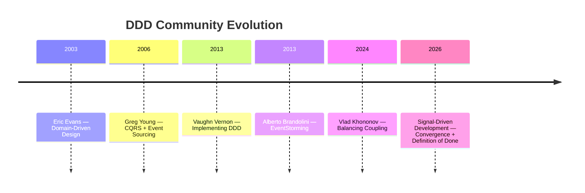

# Lineage

SDD builds on the work of the DDD community. It doesn't replace any of it -- it adds a feedback loop and a definition of done.

## Primary Influences

### Eric Evans -- *Domain-Driven Design* (2003)

[domainlanguage.com](https://www.domainlanguage.com/)

The foundational work. Evans established the building blocks (aggregates, bounded contexts, entities, value objects) and strategic patterns (context mapping, shared kernel, anti-corruption layer) that SDD uses as its structural vocabulary. The gap report evaluates specifications against Evans' principles.

**SDD connection:** Structural gaps (SG) and language gaps (LG) derive directly from Evans' emphasis on model integrity and ubiquitous language.

### Greg Young -- CQRS + Event Sourcing (2006)

Young formalized the separation of command and query models and the event sourcing pattern. His work on event-driven architectures informs how SDD evaluates command-event relationships and aggregate consistency boundaries.

**SDD connection:** The command-event correspondence check (SG-02: "command with no corresponding domain event") derives from Young's patterns.

### Vaughn Vernon -- *Implementing Domain-Driven Design* (2013)

[Amazon](https://www.amazon.com/Implementing-Domain-Driven-Design-Vaughn-Vernon/dp/0321834577)

Vernon provided tactical guidance for implementing DDD. His "small aggregate" heuristic and practical advice on aggregate design directly inform SDD's heuristic thresholds.

**SDD connection:** The aggregate command density threshold (6 or fewer commands) comes from Vernon's work. See [[Heuristic Thresholds]].

### Alberto Brandolini -- EventStorming (2013)

[eventstorming.com](https://www.eventstorming.com/)

Brandolini created the collaborative discovery vocabulary that powers modern DDD workshops. EventStorming's "event triggers command" pattern informs how SDD identifies missing policies and sagas.

**SDD connection:** The policy fan-out threshold (1 event in, 1 command out) and saga detection heuristics derive from EventStorming vocabulary.

### Vlad Khononov -- *Balancing Coupling in Software Design* (2024)

[InformIT](https://www.informit.com/store/balancing-coupling-in-software-design-universal-design-9780137353538)

Khononov formalized coupling as a measurable heuristic. His work on balancing coupling informs how SDD evaluates cross-context dependencies and relationship types.

**SDD connection:** Context term overlap thresholds and relationship type evaluation draw from Khononov's coupling analysis.

### Narrative-Driven Development

[narrativedriven.org](https://narrativedriven.org/)

Temporal vocabulary and the moment primitive. NDD's focus on narrative structure as a modeling tool complements SDD's convergence model.

## The SDD Contribution

SDD does not replace EventStorming, CQRS, or any existing DDD technique. It addresses a specific gap in the DDD ecosystem:

> **DDD has never had a definition of done for domain modeling.**

SDD provides:
1. **A structured diagnostic process** (gap reports) that replaces intuition with measurement
2. **A convergence model** that provides a measurable endpoint (zero unresolved gaps)
3. **A solo-practitioner path** that doesn't require workshops or teams

## Timeline

