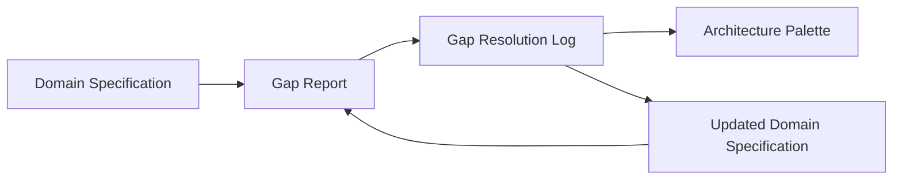

# Templates Overview

SDD provides four core templates that structure the convergence process. All templates are located in the `templates/` directory of the repository.

## The Four Templates

| Template | File | Purpose | Required? |
|----------|------|---------|-----------|
| **Domain Specification** | `domain-specification.md` | Express the domain model in DDD building blocks | Yes |
| **Gap Report** | `gap-report.md` | Evaluate the specification against four gap categories | Yes |
| **Gap Resolution Log** | `gap-resolution-log.md` | Document resolution decisions with rationale | Strongly recommended |
| **Architecture Palette** | `architecture-palette.md` | Visual projection of the domain model | Optional |

## Template Lifecycle



1. **Domain Specification** -- the living document. Written first, updated after each resolution pass.
2. **Gap Report** -- run against the current specification. Immutable snapshot.
3. **Gap Resolution Log** -- documents decisions against each gap. Immutable snapshot.
4. **Architecture Palette** -- visual verification surface. Typically created at convergence (Pass 3).

## Using the Templates

### Option 1: Manual Copy

Copy the four files from `templates/` into your project:

```text
my-project/
  pass-1/
    domain-specification.md
    gap-report.md
    gap-resolution-log.md
    architecture-palette.md
```

### Option 2: Scaffolding Script

Use the `init-domain.sh` script to automate setup:

```bash
./scripts/init-domain.sh "My Project" 1
```

This creates the directory structure, copies all templates, and replaces placeholders (domain name, pass number, date). See [[Scaffolding Script]] for details.

## Template Metadata

Each template begins with a blockquote header containing metadata:

```markdown
> **Source Input**: [PRD, requirements, process descriptions, etc.]
> **Pass**: [1, 2, 3, ...]
> **Date**: [YYYY-MM-DD]
> **Status**: [Draft | Gap report pending | Converged]
```

## Immutability Model

- The **domain specification** is the only mutable artifact -- it evolves across passes
- **Gap reports** and **gap resolution logs** are immutable snapshots
- This separation ensures traceability: you can always see how the model evolved and why
- Each pass directory (`pass-1/`, `pass-2/`, `pass-3/`) preserves the state at that point in time

## Detailed Template References

- [[Template: Domain Specification]]
- [[Template: Gap Report]]
- [[Template: Gap Resolution Log]]
- [[Template: Architecture Palette]]
